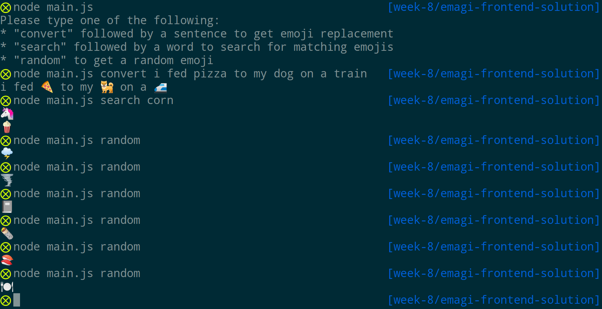

# Emagi - Frontend

### Introduction

Today, we'll be working on the front end for our node app from the [Emagi Backend exercise](https://github.com/ci-wdi-900/emagi-backend). We'll start from our solution to that, and imagine that someone else has been doing all the backend work for us.

Let's `node` away!

### What's our app... do?

This!

### About `process.argv`

We no longer need a custom `getInput` function, because we understand arrays now! We're going to use `process.argv` instead, the built-in array that node populates with our user arguments. Do some research on it if you wish, but here's the short version: it's an array of strings, and each string is one of the space-separated words the user typed in. So, if they typed in `convert i love pizza`, then 'convert' would be at index 0, 'i' at index 1, and so on. **Except there's a twist!** Node also counts 'node' and 'main.js' as words, so the user's real arguments begin at index **2**. Check out the Array `.slice` for grabbing from a certain index on! (Not to be confused with the string slice method of the same name, though.)

### Steps

* Create a `main.js` file. This will be the only place we'll have to work!
* We're going to need all three of our functions, for search, convert, and random. `require` each in from its respective file.
* Use `process.argv` to find the command they typed in. So if they typed in `node main.js search pizza`, 'search' is what you want.
* Now we just have to 1. check WHICH command the user typed in, 2. pass the right values into the right function given what the user wants us to do, and 3. `console.log` an appropriate response.
* If the user's command was 'convert', we will have to MAKE an array out of all the words the user typed in after that command. An array of strings is exactly what `emagify` is expecting, so let's give it what it wants! Before console.logging the return value of giving that array to `emagify`, we may have to massage the output somewhat. Look into what `.join` can do for you to make the array of words into one long space-separated string!
* If their command was 'search', we only need to look at one word after that command, as `emagiSearch` is only expecting a single-word string. We will get an array back from `emagiSearch`. How can we print an array, though? Hmm.
* If their command was 'random', we only need to pass `symbols` to our `randomElement` function. It will give us back one string, which we can `console.log`.
* If it was none of those, we should give the user a proper message telling them how they SHOULD be using our app.

### Stretch Goals

* Right now, words that end sentences have periods on the end of them, and thus will not convert properly. How can we fix that?
* Add some emojis! You can never have too many. [citation needed]
* Make an emoji [mad libs](https://en.wikipedia.org/wiki/Mad_Libs) command possible. It could work like this:

What we're doing here is grabbing a random food emoji whenever we see the word "food" and a random emotion emoji whenever we see the word "emotion". You'll have to devise categories, and some of the logic is already there for you in the randomizing function. Up to you how to implement it, exactly!
